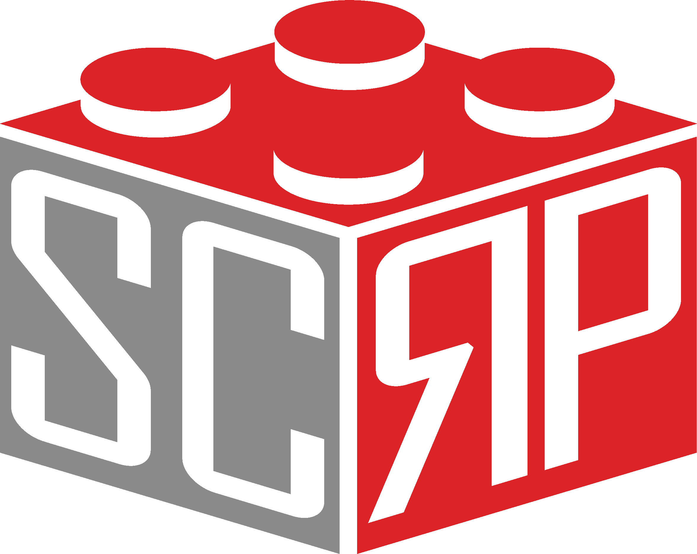

# Processing Examples
Examples using Processing and Python!\

## SCRP
\
The Schlich Community Robotics Program (SCRP) is a club from the University of Calgary, that focuses on creating
programs to teach youth robotics, programming, problem-solving, etc. These processing examples are tied in with
the `Discover Programming (DP)` program. Along with DP, SCRP offers a variety of different courses:

- Discover Robotics
- Discover Electronics
- First Lego League
- First Robotics Competition
- RoboRave

### `CONTACT`
For volunteering opportunities, contact Ben or Kirk at Volunteers@thesteamgeneration.ca for more information.\
For more information regarding workshops and joining the parent email list, contact Libby at Vp@thesteamgeneration.ca.

## Installation
Download the latest version of Processing [here](https://processing.org/download/).

The default native language of Processing is Java and the Python interface mode can be installed through the Processing UI.