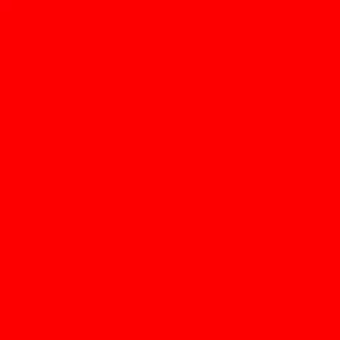

# Background Changer

## What is this?
This is visual designed in Processing, that cycles background colours in the display window.

## What core ideas does this include?
### Programming fundamentals
- Variables
- Globals
- Background function (Processing)
- Draw function (Processing)

### Software/Game Principles
- Having delay or "pauses" in a program, and why it is used