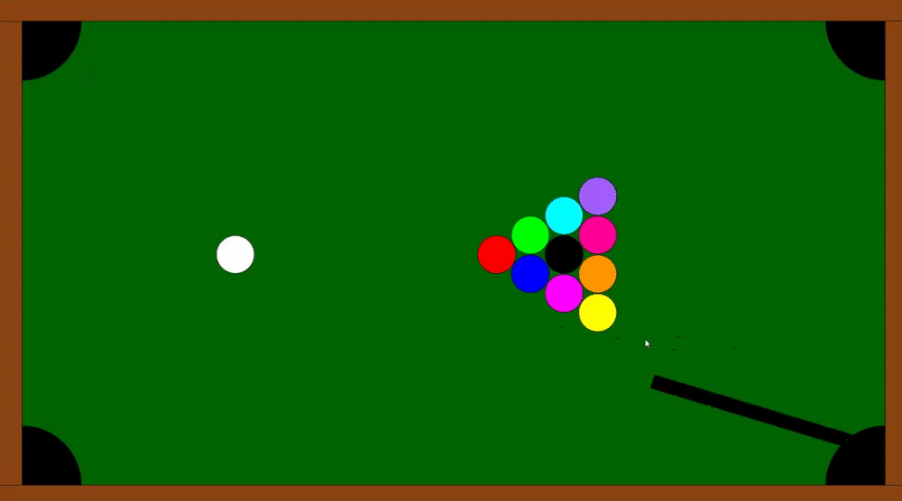

# Billiard Game

## What is this?
This is a billiard (pool) game designed in Processing.

## How to play?
Move your mouse to control where the pool cue stick is. Hold space bar to adjust the power that is going to be used to strike the ball (colour will change to red to indicate this). When ready to strike white ball, left-click with the cue stick at the edge of the white ball.

Win by getting all the balls in the holes (order doesn't matter nor the order of getting the black ball in). You will be presented the "Game Over" screen if at any point you sink the white ball.

## What core ideas does this include?
### Programming Fundamentals
- Variables
- Globals
- Functions
- Mouse and keyboard inputs

### Software/Game Principles
- Game states
- Collision detection