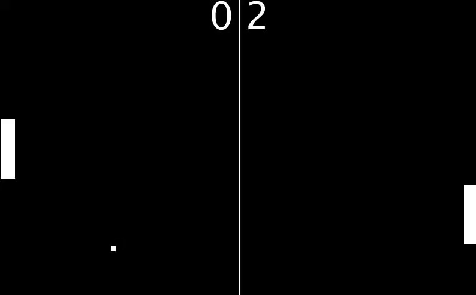

# Pong Game

## What is this?
This is a game designed in Processing.

## How to play?
To play you use the UP/DOWN arrow keys on your keyboard to move the left paddle up and down, respectively.

## What core ideas does this include?
### Programming Fundamentals
- Variables
- Globals
- Functions
- Mouse and keyboard inputs

### Software/Game Principles
- Game states
- Collision detection

