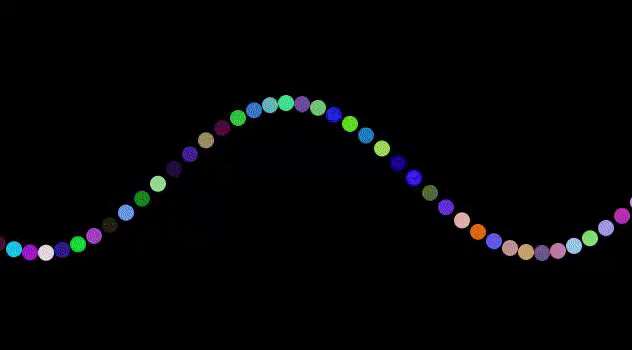

# Sine Visual Wave

## What is this?
This is a visual of a mathematical sine wave designed in Processing.

## What core ideas does this include?
### Programming Fundamentals
- Variables
- Globals
- Functions

### Software/Game Principles
- Trigonometry
- Random function