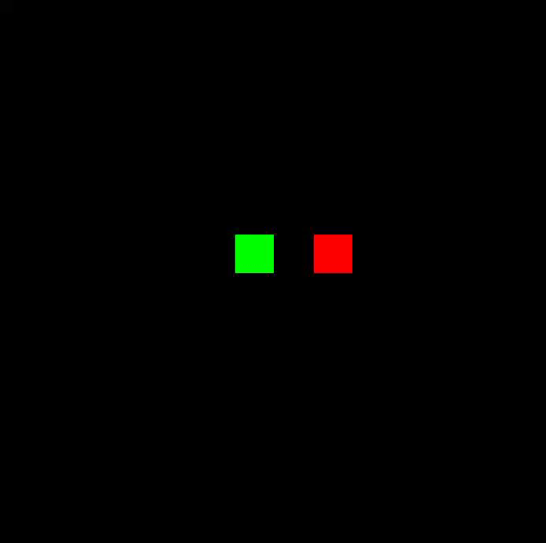

# Snake Game

## What is this?
This is a game designed in Processing.

## How to play?
The player is represented by the green boxes (snake) and the objective is
to consume the red squares that are randomly placed on the screen. The
goal, is to grow the snake as large as possible without running into the
walls or colliding into the snake's body. To play, use WASD controls to
guide the snake around the screen.

## What core ideas does this include?
### Programming Fundamentals
- Variables
- Globals
- Functions
- Keyboard inputs

### Software/Game Principles
- Collision detection
- Timing and delays