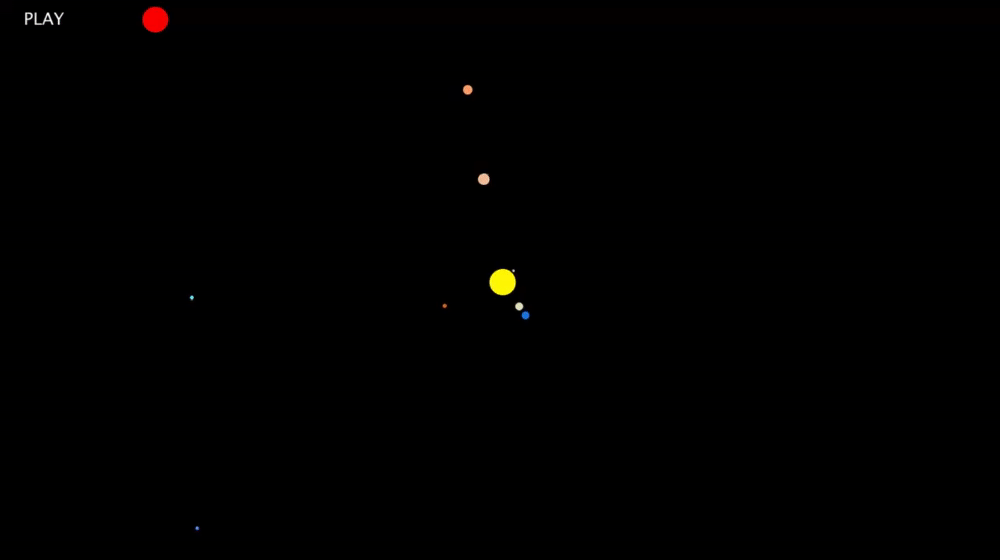

# Solar System

## What is this?
This is a visual of the solar system (not to scale) designed in processing.

## What core ideas does this include?
### Programming Fundamentals
- Variables
- Globals
- Mouse inputs

### Software/Game Principles
- Trigonometry
- Creating buttons