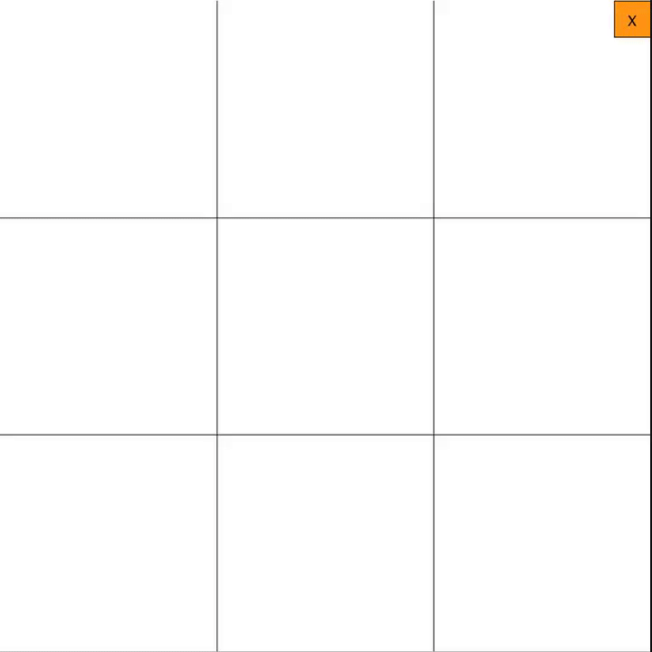

# Snake Game

## What is this?
This is a game designed in Processing.

## How to play?
Allow for two people to play Tic Tac Toe by pressing on the grid they wish to place their symbol (X or O). Get three in a row before your opponent to win.

## What core ideas does this include?
### Programming Fundamentals
- Variables
- Globals
- Functions
- Lists
- Mouse press inputs
- Key press inputs
- Tuples

### Software/Game Principles
- Mouse position